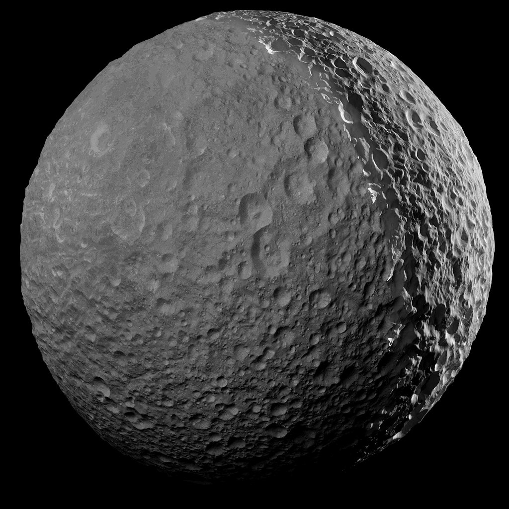
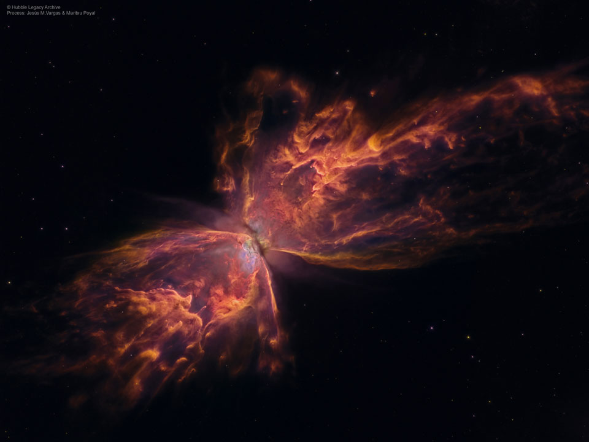

# MMM-NASA

A MagicMirror module to display the Astronomy Picture of the Day from NASA

## Example
Mimas, one of Saturn's moons, taken by the Cassini spacecraft and the Butterfly Nebula from Hubble

 

## Dependencies

* An installation of [MagicMirror<sup>2</sup>](https://github.com/MichMich/MagicMirror)
* npm
* [request](https://www.npmjs.com/package/request)
* [moment](https://www.NEED URL.com/package/moment)

## Info

* No API key is necessary but these limits apply.
* 30 requests per IP address per hour
* 50 requests per IP address per day.

## Installation

* Clone this repo into `~/MagicMirror/modules` directory.
* `cd MMM-NASA`
* `npm install` in ~/MagicMirror/modules/MMM-NASA directory.

## Add to Config.js

    ```
    {
        module: "MMM-NASA",
        position: "top_center",
        config: {
            header: "",
            picWidth: "250px",
            picHeight: "250px",
            ...
        }
    },
    ```

## Config Options

| **Option** | **Default** | **Description** |
| --- | --- | --- |
| `updateInterval` | `10 * 360000` (1 hour) | How often should the data be fetched in ms. |
| `animationSpeed` | `1000` | The speed at which the module loads in ms. |
| `initialLoadDelay` | `2500` | Module load delay in ms |
| `retryDelay` | `2500` |Delay to retry fetching data. |
| `header` | `""` | Add header between the `""` if desired. |
| `picWidth` | `""`|  Choose width of image between the `""` (Ex: `200px`). |
| `picHeight` | `""` | Choose height of image between the `""` (Ex: `200px`).. |

