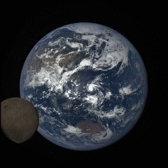

# MMM-EARTH

A MagicMirror module to display real time pictures of the Earth as it rotates. The sunlit side!

## How we look - from 1,000,000 miles away!

##
On July 5th, 2016, the moon passed between DSCOVR and the Earth. EPIC snapped these images over a period of about 4 hours. In this set, the far side of the moon, which is never seen from Earth, passes by. The DSCOVR satellite is, at times, 1 million miles away, more than 4 times further away than the moon itself.

## EDIT! On August 21, 2017, MMM-EARTH captured a unique perspective of the Total Solar Eclipse!

* Rather than crowd this README with more pictures, you can simply click the link below to see the result.
* https://forum.magicmirror.builders/topic/4688/today-s-total-solar-eclipse/2

## How you see it

NASA's Earth Polychromatic Imaging Camera (EPIC), aboard NOAA's DSCOVR satellite, provides daily, full disc imagery of the Earth and captures unique perspectives of certain astronomical events, such as lunar transits. (Seen above) EPIC uses a 2048x2048 pixel CCD detector coupled to a 30-cm aperture Cassegrain telescope. The DSCOVR satellite was launched by SpaceX on a Falcon 9 two-stage rocket on February 11, 2015 from Cape Canaveral.

## Hardware
* Works nicely on a Raspberry Pi 3 with default settings (after caching images for a few seconds).
* Works best on a motherboard that is more robust than a Raspberry Pi 3. Results shown above.

## Info

* No API key is necessary but these limits apply.
* 50 requests per IP address per day.

## Installation of module and dependencies

* `git clone https://github.com/mykle1/MMM-EARTH.git` into `~/MagicMirror/modules` directory.
* `npm install` in your `~/MagicMirror/modules/MMM-EARTH` directory.

## Add to Config.js

    {
        module: "MMM-EARTH",
        position: "bottom_center",
        config: {
            mode: "Natural",
            rotateInterval: 15000,
            MaxWidth: "50%",
            MaxHeight: "50%",
        }
    },

## Config Options

| **Option** | **Default** | **Description** |
| --- | --- | --- |
| `mode` | `Natural` | Natural, Enhanced, Lunar, naturalThumb, enhancedThumb. |
| `updateInterval` | `30*60*1000` | Every 30 minutes = 48. DO NOT exceed 50 per day. |
| `animationSpeed` | `3000` | The speed at which each new image fades in and out. |
| `rotateInterval` | `15000` | The time between each new image. (Rotation) |
| `initialLoadDelay` | `2500` | Module load delay in ms |
| `retryDelay` | `2500`  |Delay to retry fetching data. |
| `useHeader` | false | Must be set to true if you want a header |
| `header` | `"Your Header"` | Add header between the `""` if desired. |
| `MaxWidth` | `"50%"`|  Choose width of image. Should be the same as MaxHeight. |
| `MaxHeight` | `"50%"` | Choose height of image. Should be the same as MaxWidth. |

This module would not be possible without the unfailing patience, generosity and kindness of:
## cowboysdude (Module Developer Extraordinaire & Tutor) 
Consultations and additions by:
## Strawberry 3.141 (Super Genius).
## Credit: NASA's Earth Polychromatic Imaging Camera (EPIC) team.

